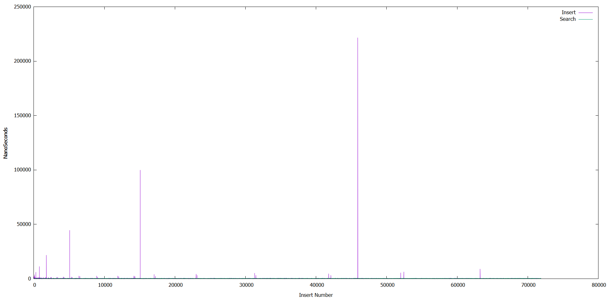

# Analysis
## Testing complexity
I run the program with the following command:
```shell
bin/main.exe -c ressources/Jules_Verne_Voyage_au_centre_de_la_Terre.txt output.txt 10000
```
This command therefore launched a complexity test on 10000 unordered_map.<br/>
In the output file we find:

+ 1st column: Insert time for a word
+ 2nd column: Search time for the same word

## Graph
With [gnuplot](http://www.gnuplot.info/) we get this graph with the output file and the following commands:
```gnuplot
plot 'path/to/output.txt' using 2 w l title "Insert", 'path/to/output.txt' using 1 w l title "Search"
set ylabel "NanoSeconds"
set xlabel "Insert Number"
```



## Observations
We can observe that the search times are relatively constant O(1) (green curve). While insertion times are generally constant O(1) except for some very visible peaks and seems linear (purple curve).

## Explaination
The peaks represent the moment when the hash table is reassigned to avoid a too large number of collisions.<br/>
Moreover, the relatively constant trend of the curves shows that the unordered_map object for its insertion and search functions is generally of complexity O(1), else in the worst case O(n).